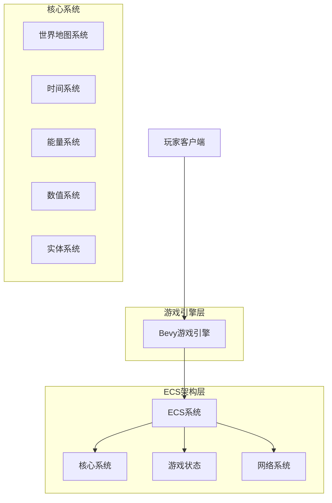

# Dark Forest - 技术架构文档

## 1. 架构设计



## 2. 技术栈描述

- **游戏引擎**: Bevy 0.18 (Rust)
- **物理引擎**: bevy_rapier2d (2D物理系统, 适配Bevy 0.18版本)
- **网络框架**: bevy_renet (多人游戏网络, 适配Bevy 0.18版本)
- **地图系统**: bevy_ecs_tilemap (瓦片地图, 适配Bevy 0.18版本)
- **序列化**: bevy_reflect, serde (数据序列化)
- **初始化工具**: cargo

### 核心依赖

```toml
[dependencies]
bevy = "0.18.0"
bevy_rapier2d = "*"  # 请使用适配Bevy 0.18的最新版本
bevy_renet = "*"     # 请使用适配Bevy 0.18的最新版本
bevy_ecs_tilemap = "*" # 请使用适配Bevy 0.18的最新版本
bevy_reflect = "0.18.0"
serde = { version = "1.0", features = ["derive"] }
renet = "*"
rapier2d = "*"
```

## 3. 核心系统设计

### 3.1 游戏状态管理

```rust
// 游戏状态枚举
#[derive(Debug, Clone, Copy, Default, Eq, PartialEq, Hash, States)]
pub enum GameState {
    #[default]
    Loading,      // 加载状态
    MainMenu,     // 主菜单
    Settings,     // 设置界面
    GameSetup,    // 游戏设置
    InGame,       // 游戏中
    Paused,       // 暂停状态
    GameOver,     // 游戏结束
}
```

### 3.2 世界与地图系统

```rust
// 地图组件
#[derive(Component)]
pub struct MapTile {
    pub tile_type: TileType,
    pub position: TilePos,
    pub explored: bool,
    pub visible: bool,
}

// 地图资源
#[derive(Resource)]
pub struct WorldMap {
    pub width: u32,
    pub height: u32,
    pub seed: u64,
    pub tiles: Vec<Vec<MapTile>>,
    pub fog_of_war: bool,
}

// 瓦片类型
#[derive(Debug, Clone, Copy, PartialEq)]
pub enum TileType {
    Forest,      // 森林
    Desert,      // 沙漠
    Mountain,    // 山脉
    Water,       // 水域
    Plains,      // 平原
    DarkForest,  // 黑暗森林
}
```

### 3.3 时间系统

```rust
// 时间资源
#[derive(Resource)]
pub struct GameTime {
    pub day: u32,
    pub hour: f32,        // 0-24
    pub minute: f32,      // 0-60
    pub day_night_cycle: DayNightCycle,
}

// 昼夜循环
#[derive(Debug, Clone)]
pub struct DayNightCycle {
    pub day_length: f32,     // 一天的实际长度（秒）
    pub current_phase: DayPhase,
    pub light_intensity: f32,
}

#[derive(Debug, Clone, Copy, PartialEq)]
pub enum DayPhase {
    Dawn,    // 黎明
    Day,     // 白天
    Dusk,    // 黄昏
    Night,   // 夜晚
}
```

### 3.4 实体与组件系统

```rust
// 玩家组件
#[derive(Component)]
pub struct Player {
    pub id: u64,
    pub name: String,
    pub level: u32,
    pub experience: u64,
}

// 宠物组件
#[derive(Component)]
pub struct Pet {
    pub owner: Entity,
    pub pet_type: PetType,
    pub loyalty: f32,
    pub hunger: f32,
}

// 机器人组件
#[derive(Component)]
pub struct Robot {
    pub robot_type: RobotType,
    pub energy_consumption: u64,
    pub efficiency: f32,
}

// 敌人组件
#[derive(Component)]
pub struct Enemy {
    pub enemy_type: EnemyType,
    pub health: u64,
    pub damage: u64,
    pub aggression_range: f32,
}

// 建筑组件
#[derive(Component)]
pub struct Building {
    pub building_type: BuildingType,
    pub level: u32,
    pub construction_time: f32,
    pub is_completed: bool,
}
```

### 3.5 能量系统

```rust
// 能量资源
#[derive(Resource)]
pub struct EnergySystem {
    pub global_energy: u128,
    pub energy_generation_rate: u64,
    pub energy_consumption_rate: u64,
}

// 能量组件
#[derive(Component)]
pub struct Energy {
    pub current: u64,
    pub maximum: u64,
    pub regeneration_rate: f32,
}

// 能量生成器组件
#[derive(Component)]
pub struct EnergyGenerator {
    pub generation_rate: u64,
    pub efficiency: f32,
    pub is_active: bool,
}
```

### 3.6 数值系统

```rust
// 大数值处理
#[derive(Component, Debug, Clone)]
pub struct BigNumber {
    pub value: u128,
    pub multiplier: f64,
}

// 数值格式化
impl BigNumber {
    pub fn format(&self) -> String {
        // 处理大数值显示，如：1.5M, 2.3B, 1.2T
        let value = self.value as f64 * self.multiplier;
        format_large_number(value)
    }
}

// 防溢出计算
pub fn safe_multiply(a: u64, b: u64) -> u128 {
    (a as u128) * (b as u128)
}
```

## 4. 网络系统设计

### 4.1 客户端-服务器架构

```rust
// 网络配置
#[derive(Resource)]
pub struct NetworkConfig {
    pub server_addr: String,
    pub max_clients: usize,
    pub tick_rate: u64,
}

// 游戏消息枚举
#[derive(Debug, Clone, Serialize, Deserialize)]
pub enum GameMessage {
    PlayerMove { player_id: u64, position: Vec2 },
    EntitySpawn { entity_type: EntityType, position: Vec2 },
    EnergyUpdate { player_id: u64, amount: u64 },
    BuildingPlace { player_id: u64, building_type: BuildingType, position: Vec2 },
}
```

### 4.2 同步策略

- **状态同步**: 关键游戏状态（玩家位置、建筑、能量）
- **事件同步**: 重要事件（建造、战斗、交互）
- **预测与回滚**: 客户端预测 + 服务器权威
- **增量更新**: 只同步变化的数据

## 5. 目录结构

```
dark-forest/
├── Cargo.toml
├── assets/
│   ├── textures/          # 贴图资源
│   ├── audio/              # 音频文件
│   ├── fonts/              # 字体文件
│   └── maps/               # 地图数据
├── src/
│   ├── main.rs             # 程序入口
│   ├── lib.rs              # 库根文件
│   ├── states/             # 游戏状态
│   │   ├── mod.rs
│   │   ├── loading.rs
│   │   ├── menu.rs
│   │   └── ingame.rs
│   ├── systems/            # 游戏系统
│   │   ├── mod.rs
│   │   ├── map.rs          # 地图系统
│   │   ├── time.rs         # 时间系统
│   │   ├── energy.rs       # 能量系统
│   │   ├── entities.rs     # 实体系统
│   │   └── combat.rs       # 战斗系统
│   ├── components/         # ECS组件
│   │   ├── mod.rs
│   │   ├── player.rs
│   │   ├── enemy.rs
│   │   ├── building.rs
│   │   └── energy.rs
│   ├── resources/          # 游戏资源
│   │   ├── mod.rs
│   │   ├── world.rs
│   │   ├── time.rs
│   │   └── energy.rs
│   ├── network/            # 网络系统
│   │   ├── mod.rs
│   │   ├── client.rs
│   │   ├── server.rs
│   │   └── messages.rs
│   ├── utils/              # 工具函数
│   │   ├── mod.rs
│   │   ├── math.rs         # 数学计算
│   │   └── format.rs       # 格式化
│   └── ui/                 # 用户界面
│       ├── mod.rs
│       ├── hud.rs          # HUD界面
│       └── menus.rs        # 菜单界面
└── docs/                   # 文档
    └── architecture.md     # 架构文档
```

## 6. 性能优化策略

### 6.1 ECS优化

- 合理使用查询过滤器
- 避免频繁的组件添加/删除
- 使用系统调度优化执行顺序

### 6.2 渲染优化

- 视锥体剔除
- 遮挡剔除
- 批处理渲染
- LOD（细节层次）系统

### 6.3 内存管理

- 对象池模式
- 预分配内存
- 避免运行时分配

## 7. 扩展性考虑

### 7.1 模块化设计

- 插件化架构
- 系统间低耦合
- 清晰的接口定义

### 7.2 数据驱动

- 配置化游戏参数
- 可热重载的资源
- 灵活的实体模板系统

### 7.3 多人游戏扩展

- 支持更多玩家
- 服务器集群
- 负载均衡
- 数据持久化
